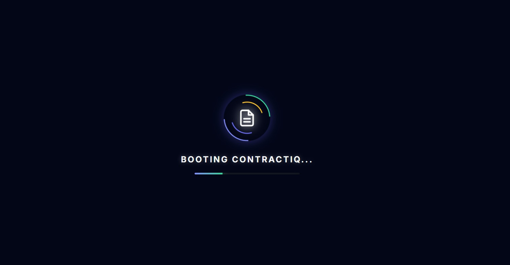
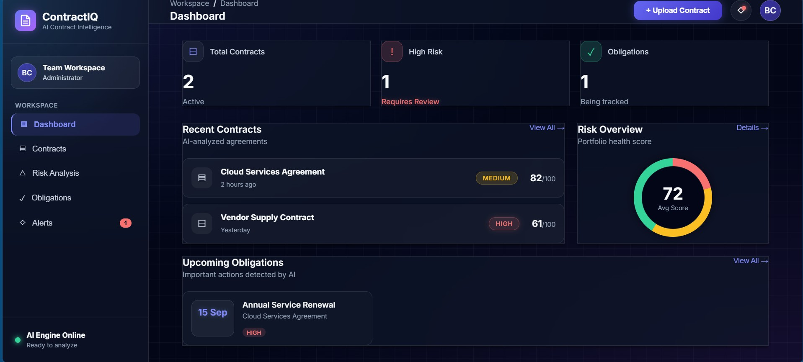

# 📄 ContractIQ | AI Contract Intelligence


> **ContractIQ** is a next-generation AI legal assistant that instantly analyzes legal documents, extracts hidden liabilities, tracks critical deadlines, and calculates a portfolio risk score.

### 📸 Sneak Peek
*Experience the cyberpunk-inspired glassmorphism UI.*

**System Boot Sequence:**


**Executive Dashboard:**


*(Clone the repo to see the live AI analysis and animations in action!)*

---

## 🚀 The Problem
Every day, businesses sign contracts they haven't fully read because manual legal review is slow, expensive, and prone to human error. **Hidden liabilities, predatory auto-renewals, and missed deadlines cost companies millions of dollars annually.**

## 💡 Our Solution
**ContractIQ** acts as an automated, AI-powered paralegal. By simply uploading a PDF, our system leverages Google's **Gemini 2.0 Flash** to read the fine print, identify legal traps, and generate an actionable executive dashboard in seconds.

## ✨ Key Features
- **🔍 Instant Risk Scoring:** AI calculates a 1-100 "Health Score" based on contractual liabilities.
- **📅 Obligation Tracking:** Automatically extracts Net-payment terms, renewal dates, and deadlines.
- **🚨 Smart Alerts:** Flags predatory clauses (e.g., hidden fee increases, bad indemnification clauses).
- **📱 Emergency SMS Routing:** Automatically dispatches high-priority Twilio SMS alerts for critically high-risk contracts.
- **🗄️ Secure Logging:** Documents and metadata are securely logged to a NoSQL database (TinyDB) with digital signature versioning.
- **💻 Premium UI:** A beautiful, responsive, cyberpunk-inspired glassmorphism dashboard featuring dynamic spotlight tracking.

---

## 🛠️ Tech Stack
* **Frontend:** React.js, CSS3 (Glassmorphism UI, Custom CSS Animations, Dynamic Cursor Tracking)
* **Backend:** Python, FastAPI, PyMuPDF (Text Extraction)
* **AI Engine:** Google Gemini 2.0 Flash API (Structured JSON Generation)
* **Integrations:** Twilio SMS API
* **Database:** TinyDB (NoSQL Document Storage)

---

## ⚙️ Local Setup & Installation

If you would like to run ContractIQ locally, follow these steps:

### 1. Clone the Repository
```bash
git clone [https://github.com/bharat-avs/AI-Powered-Contract-Risk-Obligation-Intelligence.git](https://github.com/bharat-avs/AI-Powered-Contract-Risk-Obligation-Intelligence.git)
cd AI-Powered-Contract-Risk-Obligation-Intelligence


# 2. Backend Setup (FastAPI)
# Navigate to the backend directory:

# Bash
# cd contract-ai-backend

# Create and activate a virtual environment
python -m venv venv
source venv/bin/activate  # On Windows use: venv\Scripts\activate

# Install dependencies
pip install -r requirements.txt

# Create a .env file and add your credentials
echo "GEMINI_API_KEY=your_api_key_here" > .env
echo "TWILIO_ACCOUNT_SID=your_twilio_sid" >> .env
echo "TWILIO_AUTH_TOKEN=your_twilio_token" >> .env
echo "TWILIO_PHONE_NUMBER=your_twilio_number" >> .env

# Run the backend server
uvicorn main:app --reload

# 3. Frontend Setup (React)
Open a new terminal window/tab and navigate to the frontend directory:

Bash
cd AI-Powered-Contract-Risk-Obligation-Intelligence/contract-dashboard

# Install Node dependencies
npm install

# Start the React development server
npm run dev


🧠 How it works (The Workflow)
Upload: User drops a PDF into the React dashboard and inputs an optional emergency phone number.

Extract: FastAPI intercepts the file and uses PyMuPDF to extract raw text, bypassing disk I/O latency.

Analyze: The text is sent to the Gemini 2.0 Flash model with a strict system prompt to return structured JSON.

Alert: If the AI determines a risk score of 7 or higher, the backend triggers a Twilio SMS alert.

Render: React parses the JSON, calculates the Health Score, and updates the dynamic charts and obligation grids instantly.

👨‍💻 Built with ❤️ by Halo vibe for the Hackathon
